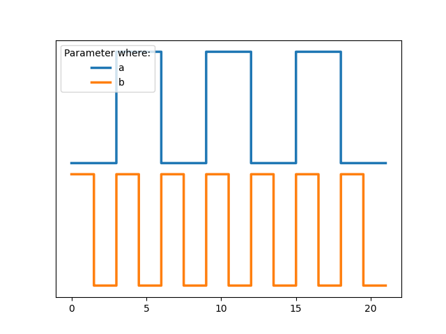

# VSyncDBG

# Install Requirements

```shell
pip3 install -r requirements.txt
```

# Run

```shell
python3 main.py
```

# Easy to Use

```python
from io import StringIO
from Machine import Machine
from draw import draw

with StringIO() as f:
    m = Machine(f, dump_signals=[
        'a'
    ])


    def updater1(u: Machine):
        a = u.get_signal("a")
        if not a.keeping(3):
            a.set(1 - a.get())


    m.add_updater(updater1)

    for i in range(21):
        m.update(1)

    f.seek(0)
    draw(f)
```


